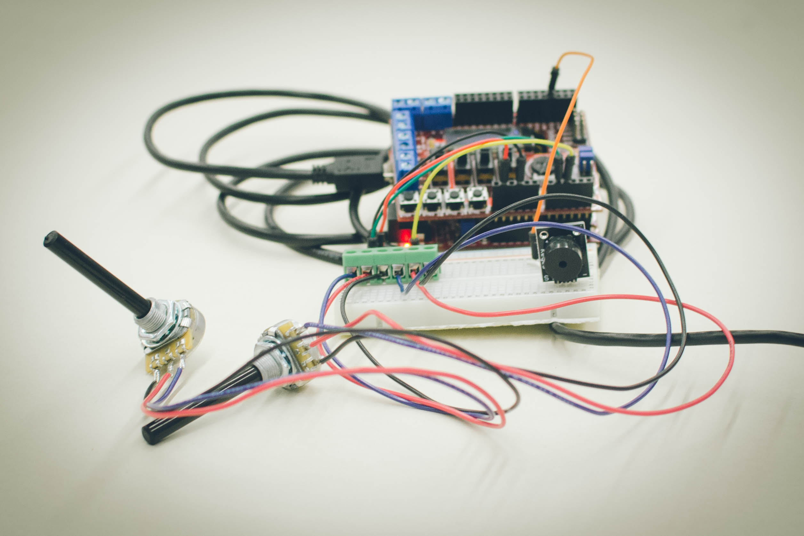
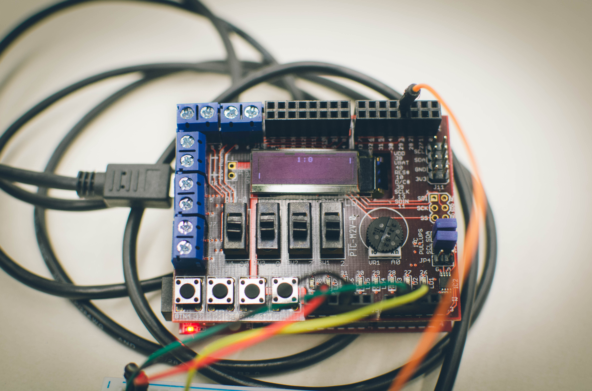

# ChipKit Pong
The classical arcade video game implemented on a ChipKit Uno32 microcontroller.

Use the [Pic32MX toolchain](https://github.com/is1200-example-projects/mcb32tools) for compiling. Requires the [chipKIT™ Uno32 by Digilent](http://chipkit.net/wpcproduct/chipkit-uno32/) with [Basic I/O Shield](http://chipkit.net/wpcproduct/chipkit-basic-io-shield/).
